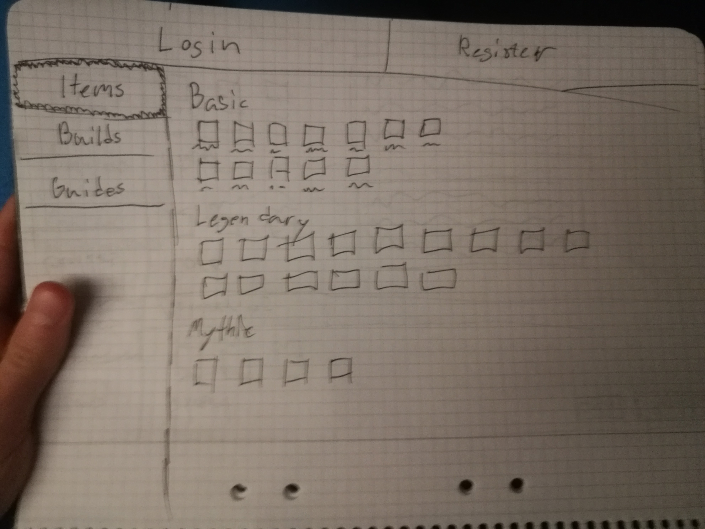
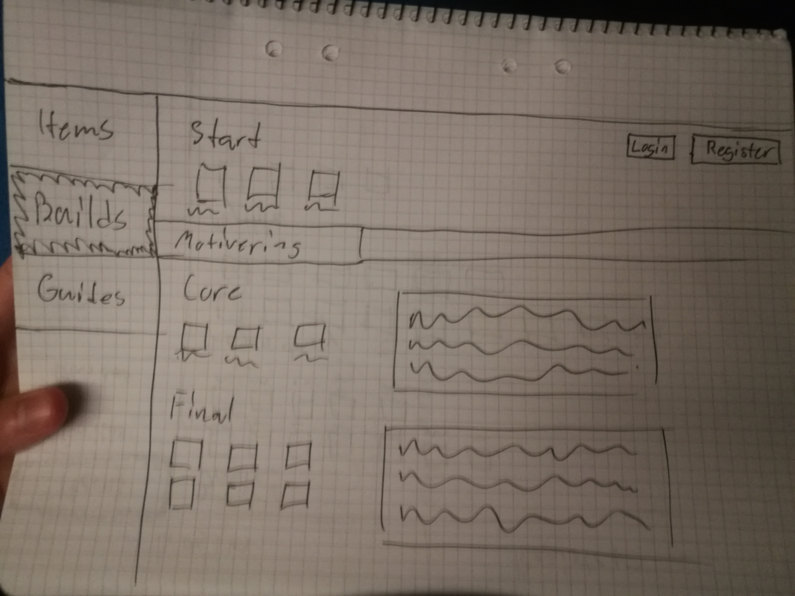
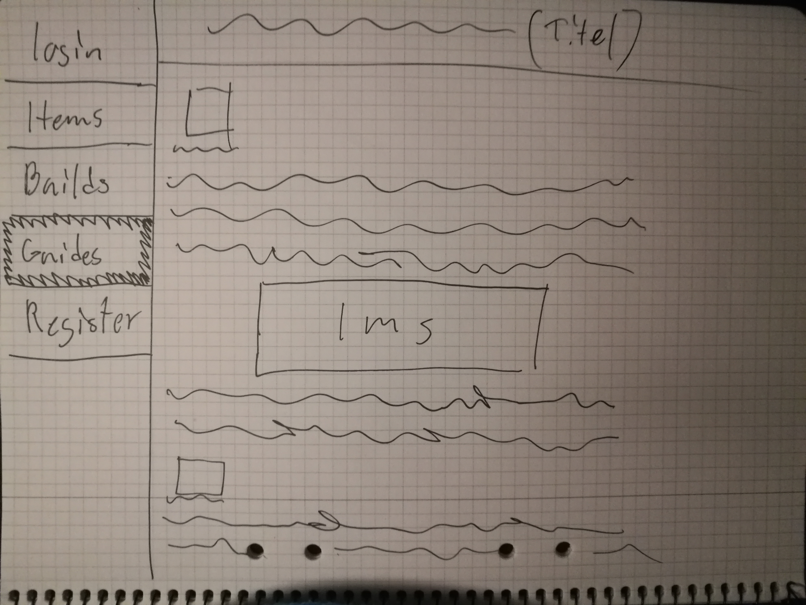
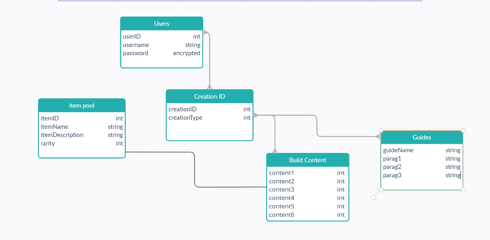

# Projektplan

## 1. Projektbeskrivning (Beskriv vad sidan ska kunna göra).
Min sida är inspererad av https://www.mobafire.com/. En webbsida som hjälper och guidar nya spelare i spelet "League of Legends". Den ska ha 3/4 funktioner:

Skapa ett konto och senare logga in och ut.
Visa de olika föremålen från spelet tillsammans med info om vad de gör.
Läsa guides som andra användare har skrivit.
Skapa "builds", alltså kombinationer av 6st föremål och spara dem. 
## 2. Vyer (visa bildskisser på dina sidor).

## 3. Databas med ER-diagram (Bild på ER-diagram).

## 4. Arkitektur (Beskriv filer och mappar - vad gör/innehåller de?).
